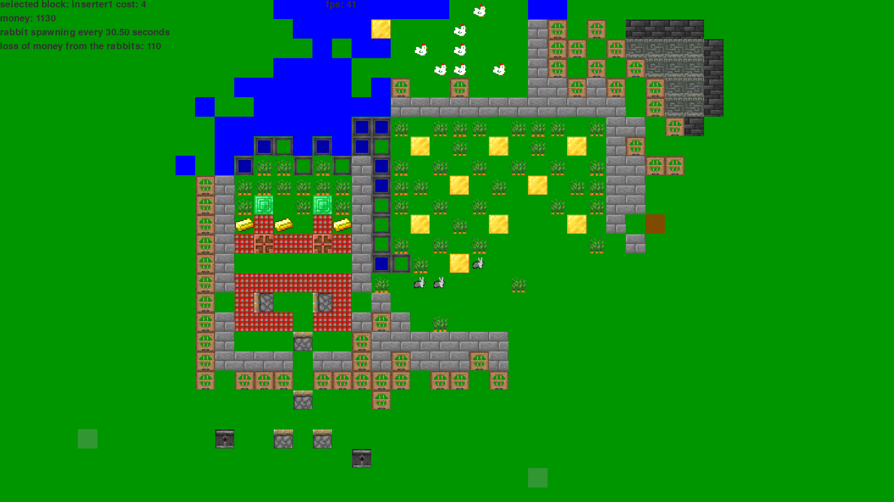

## Rabbiter

A complicated farm game, where you defend carrots from rabbits.Uses [pygame](https://www.pygame.org/)




### Installation

First, clone this repository with:

```
git clone https://github.com/mkaszynski/rabbiter
```

Then install the requirements with:

```
pip install -r requirements.txt
```

### Usage

Run with:

```
python rabbiter.py
```

#### Controls

- "wasd": use wasd keys to move about
- "e": click to change selection backwards
- "r": click to change selection forwards
- "q": press on object to change selection to it
- "Left click" : Place a block
- "Right click" : Remove a block

